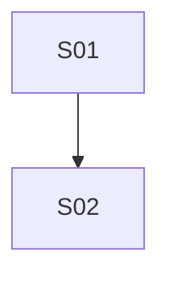

# 流程与功能对齐 — SaaS身份平台契约一致性验证仓

> 人填、人评审。机器只检查引用的功能 ID 是否存在。
> 评审时把流程图投出来，逐行念「这一步靠哪些功能完成」。念不出来的行，
> 要么流程是空的，要么功能是缺的。这就是对齐的全部意义。

## FLOW-01 （主流程名）

| 步骤 | 名称 | 角色 | 输入 | 输出 | 状态流转 | 支撑功能子项 |
|---|---|---|---|---|---|---|
| S01 | | | | | | |

### 评审时问这四个问题

1. 有没有哪个步骤的「支撑功能子项」是空的？→ 功能缺失，或这一步不该存在
2. 有没有功能子项从头到尾没出现在任何流程里？→ 见下方孤儿清单
3. 状态流转列里的状态名，和代码里的枚举一致吗？→ 不一致就是两套真相
4. 退回路径都画了吗？→ 只画正向流程，会漏掉一半功能

### 孤儿功能

不在任何流程里但合法的功能。**没解释的孤儿 = 没人要的功能。**

| 功能 ID | 为什么合法 |
|---|---|
| M96.F01.I01 | normalize 契约的 VOLATILE 档（token / jti 默认剔除）。由 harness 私有常量 `ALWAYS_VOLATILE` 提供，无流程视角——它是「同输出」判定的输入，不是任何业务流程的步骤。 |
| M96.F01.I02 | normalize 契约的 FORMAT 档（日期归一）。harness 私有函数 `normalizeDate` 提供；前端读到的字段形态由 OpenAPI 串联，不经业务流。 |
| M96.F01.I03 | normalize 契约的 FORMAT 档（缺失 ≡ 显式 null）。harness `normalize` + `stable` 实现；Spring `NON_ABSENT` 与 ASP.NET 默认输出的方言差在同一处吃掉。 |
| M96.F01.I04 | normalize 契约的 FORMAT 档（递归 key/数组排序）。harness `stable` 实现；字段顺序契约在 OpenAPI 层定，不入流程。 |
| M96.F02.I01 | 四方比对方法论规则（status 全等判定）。`compareStatuses` 实装；前端的 try/catch 分支由状态码决定，但「判定状态码分不分叉」这条规则本身不挂流程。 |
| M96.F02.I02 | 四方比对方法论规则（normalize 后 body 全等）。`compareBodies` 实装；只报第一处分叉是 ADR-0015 设计选择，不在流程里。 |
| M96.F02.I03 | 读端点四方比对（GET /me/tenants）。读操作无业务流程，「同时打 4 端」直写在 `tests/me-tenants.test.ts`，harness 自闭环。 |
| M96.F02.I04 | 读端点四方比对（GET /me）。CurrentUser 单对象；memberships 数组走 normalize 排序后比对，harness 自闭环。 |
| M96.F02.I05 | 读端点四方比对（GET /me/menus）。map<string, EffectiveMenuNode[]>；key 排序由 normalize 处理，harness 自闭环。 |
| M96.F02.I06 | 读端点四方比对（GET /apps/{code}）。公开 AppPublicInfo；带 Bearer 探。匿名路径独立 describe 留待下一批。 |
| M96.F02.I07 | 读端点四方比对（GET /tenants/{t}/roles）。分页包装；envelope + items 必填字段名集合，harness 自闭环。 |
| M96.F02.I08 | 读端点四方比对（GET /tenants/{t}/roles/{r}）。单 Role；`roleId` 与查询参数一致性断言，harness 自闭环。 |
| M96.F02.I09 | 读端点四方比对（GET /tenants/{t}/roles/{r}/menus）。RoleMenuGrant 单对象；`menuIds[]` 数组归一化后比对，harness 自闭环。 |
| M96.F02.I10 | 读端点四方比对（GET /tenants/{t}/users）。分页包装；`roleIds[]` 必填 + 数组类型断言。注：家族约定 `users.role_ids` 列为冗余占位（见 memory `users-role-ids-redundant-authoritative-memberships`），真值在 `tenant_memberships`——本端点比对走 normalize，4 后端都从 memberships 取真值时此字段自动相等。 |
| M96.F02.I11 | 读端点四方比对（GET /tenants/{t}/users/{u}）。单 User；`username === "alice"` + 4 数组必填，harness 自闭环。 |
| M96.F02.I12 | 读端点四方比对（GET /tenants/{t}/audit-events）。分页包装；items 数据走 dynamicDrop（occurredAt/metadata/actorUserId/targetUserId/items/total），envelope (`page`, `pageSize`) 比对。 |
| M96.F02.I13 | 读端点四方比对（GET /tenants/{t}/audit-events/by-user/{u}）。by-user 过滤；同 I12 envelope 比对策略，harness 自闭环。 |
| M96.F02.I14 | 读端点四方比对（GET /tenants/{t}/audit-events/retention）。单对象 `{retentionDays: number}`；无流程视角，harness 自闭环。 |
| M96.F02.I15 | 读端点四方比对（GET /tenants/{t}/api-keys）。分页包装；envelope + items 字段集合，数据不参与比对（写端点批次累积）。 |
| M96.F02.I16 | 写端点四方比对（POST /tenants/{t}/api-keys）。流程视角无法表达「同时打 4 端」，声明即直写在 `tests/tenant-api-keys-write.test.ts`，harness 自闭环。 |
| M96.F02.I17 | 写端点四方比对（POST /tenants/{t}/api-keys/{k}/revoke）。与 I16 同处直写，harness 自闭环。 |
| M96.F02.I18 | 写端点副作用验证（audit_events 出现 api_key_created/revoked）。副作用断言依赖 250ms buffer + `metadata.apiKeyId` 过滤，独立于任何业务流。 |
| M96.F03.I01 | harness 目标端口声明（`src/targets.ts` `TARGETS`）。跨切元能力，端口是 conventions §6 显式字面量；套件既不消费也无业务流程「声明端口」一步。 |
| M96.F03.I02 | harness 「声明即必须可达」不变量（`src/targets.ts` `selectedTargets` + `TargetError`）。跨切不变量的执行点，不挂流程。 |

---

> **2026-08-31 注（本批未清理的 7 条「无测试引用」）：** 豁免后 L5 仍残留的 7 条均源于
> `tests/fnReporter.ts` `loadNamespaces()` 在 `split('|')` 后从 `cells[0]`（恒为空串）取命名空间，
> 导致 `all.filter(id => namespaces.has(id.slice(0, 2)))` 恒为 `[]`，非 inert 测试 fn 全丢 trace。
> 实际 `tests/normalize.test.ts` / `tests/compare.test.ts` 的 describe 名里均含 `M96.F01.I0X` / `M96.F02.I01.I02`，
> trace.json 漏记是 reporter bug，不是测试缺失。修 `fnReporter` 属下一批范畴，本批不动。

## FLOW-02 （异常流程名）

> 异常流程单独成表，否则它承载的功能永远是孤儿。
